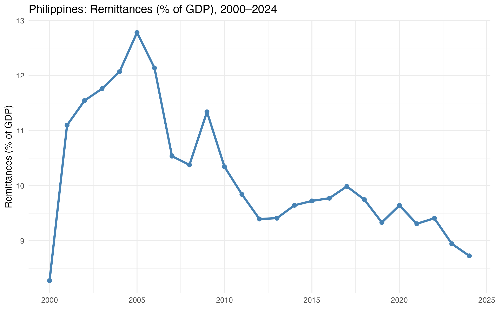
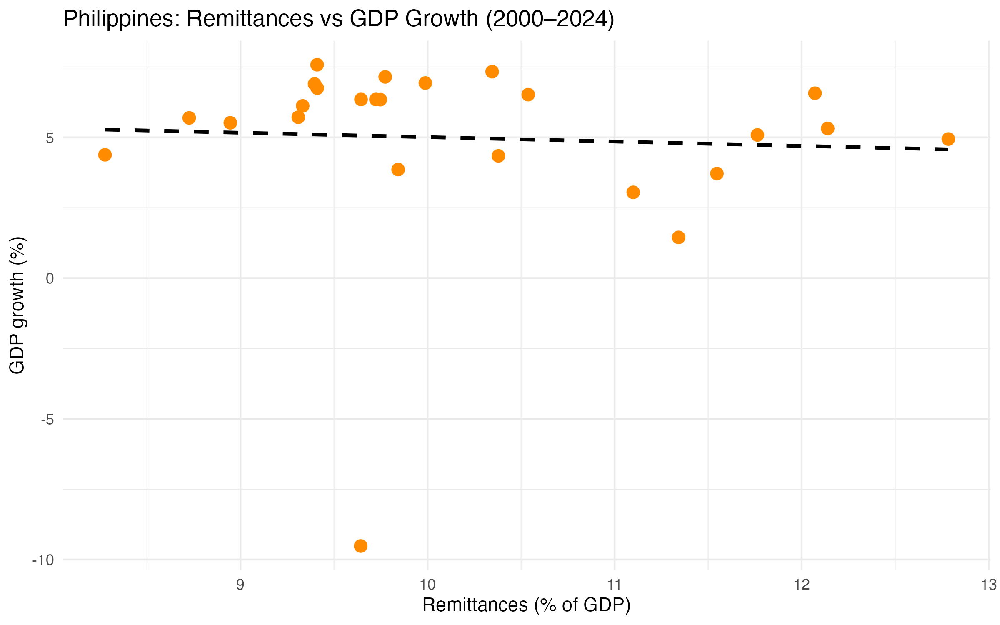

# Philippines Remittances & GDP Growth (2000–2024)

## 📌 Overview
This project analyzes the relationship between **remittances** (as % of GDP) and **annual GDP growth** for the Philippines from 2000–2024.

The aim is to:
- Track trends in remittances and GDP growth
- Explore their relationship using visualizations
- Summarize the best and worst years for each indicator

## 📊 Key Visuals
### 1. Remittances (% of GDP) Trend


### 2. GDP Growth (%) Trend


### 3. Relationship: Remittances vs GDP Growth


## 🧾 Summary Table
**[Excel: Summary of Best/Worst Years](data/processed/phl_remit_gdp_summary.xlsx)**

| Metric                | Year | Value |
|-----------------------|------|-------|
| Best Remittances Year | XXXX | XX.X |
| Worst Remittances Year| XXXX | XX.X |
| Best GDP Growth Year  | XXXX | XX.X |
| Worst GDP Growth Year | XXXX | XX.X |

*(Replace `XXXX` and `XX.X` with actual values from the Excel file.)*

## 🔎 Quick Insights
- Remittances as a % of GDP peaked in **[YEAR]** at **[VALUE]%**.
- The fastest GDP growth occurred in **[YEAR]**, reaching **[VALUE]%**.
- Scatter plot suggests a [positive/negative/weak] relationship between remittances and GDP growth.

## 🛠️ How to Reproduce
**Data file**: `PHILREM.xlsx` (sheet `Data`) with columns:  
`COUNTRY | YEAR | GDP | REM | INFL`

**R Setup**
```r
install.packages(c("tidyverse", "readxl", "writexl"))
